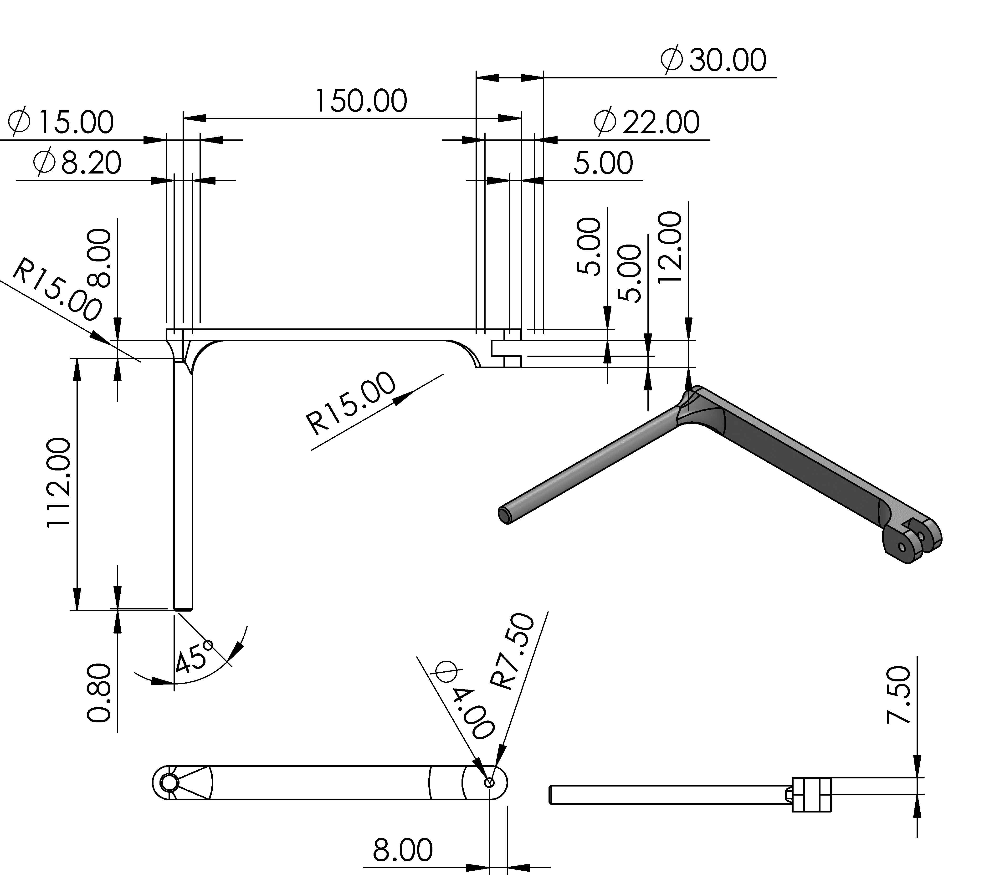

---
bibliography:
- Bib/References.bib
---

::: titlepage
::: center
{width="0.3\\linewidth"}
[]{#fig:jomologo label="fig:jomologo"}

Jomo Kenyatta University of Agriculture and Technology\
College of Engineering and Technology\
School of Mechanical, Materials, and Manufacturing Engineering\
Department of Mechatronic Engineering\
------------------------------------------------------------------------------------------------\
**Design and Fabrication of an Automated Discharge Collection Unit for
the Synthetic Hydro-experimental Machine.**\
**FYP-18-03**\
**FINAL REPORT**\
**Juma Joel Mwimali (ENM221-0060/2017)**\
**Kipng'eno Erick (ENM221-0068/2017)**\
**Supervisor**\
Dr. Anthony Muchiri\
2022-12-11\
------------------------------------------------------------------------------------------------\
Submitted in partial fulfillment of the requirements for the degree of
Bachelor of Science in Mechatronic Engineering at Jomo Kenyatta
University of Agriculture and Technology, 2022\
:::
:::

# Declaration {#declaration .unnumbered}

We hereby declare that the work contained in this report is original,
researched and documented by the undersigned students. It has not been
used or presented elsewhere in any form for award of any academic
qualification or otherwise. Any material obtained from other parties
have been duly acknowledged. We have ensured that no violation of
copyright or intellectual property rights have been committed.

1.  Juma Joel Mwimali\
    Signature..............................Date..............................

2.  Kipng'eno Erick\
    Signature..............................Date..............................

Approved by:\
**Supervisor:** Dr. Anthony Muchiri\
Signature..............................Date..............................

**Technologist:** Mr. Mbugua\
Signature..............................Date..............................

\[Abstract

# Abstract {#sec: .unnumbered}

The synthetic hydro-experimental machine used for fluid mechanics
experiments in the fluids lab at JKUAT uses a manual mechanical system
for the collection of the discharge during experiments such as the
determination of the coefficient of discharge of the Venturi and the
orifice. During such experiments, the user is required to turn the main
discharge ball valve in steps determined by human intuition, and for
every step, they are required to slide a metallic diverter to collect
the discharge to a separate tank, and at the same time, to start
measuring the temperature of the discharge, and the timer using an
analog stopwatch. This synchronism is necessary for precise data in the
computation of the fluid flow properties but cannot be achieved by
humans.

The design and fabrication of an automated discharge collection unit
intended to reduce human error by approximately 10% have been outlined
in this report. The design was modularised into three units; a discharge
flow control unit, a discharge handling unit, and an interface and a
control unit. The discharge flow control unit was designed to control
the main ball valve in steps of less than $1^0$ using a servo motor and
divert the flow in less than 1.5 seconds using a linear actuator. The
discharge handling unit was also designed with a tank that can collect
up to 25 kg of discharge. The tank was also fitted with automated
temperature and weight measurement units. The interface was designed on
a touch LCD running on an STM32 microcontroller.

This automation results in a reduction of the gross error by 8.213 %.

\[List of Figures

\[List of Tables

\[Nomenclature

\[Chapter 1. Introduction

# Introduction {#sec:introduction}

## Background

Fluid flow measurement involves the measurement of the properties of a
smooth and uninterrupted stream of flowing particles that conform to a
pipe. These flow properties include the coefficient of discharge, mass
flow rate, fluid velocity, differential pressure, and conductivity
coefficients [@pereira2009flow]. They are altered and measured by flow
measuring devices such as the Venturi, the Orifice, turbine flow meters
and rotameters [@nandagopal2022fluid]. These measurements are finally
related to the flow using the Bernoulli's equation.

The Synthetic Hydro-Experimental machine, currently installed in JKUAT,
is a configurable machine with these flow meters. This machine is used
to conduct experiments to establish relationships between the fluid flow
properties and the behavior of the flow. It has a lift pump, gate
valves, alcohol manometers, pressure gauges, a Pelton turbine, a
Venturi, an orifice, and water reservoirs. During experiments, the lift
pump is turned on, and the discharge valve is fully opened to establish
a steady flow. The discharge valve is then closed. The valve is opened
in small steps depending on the number of steps required. For each step,
the discharge is collected, and its temperature is measured within a
specific time interval. Finally, the weight of the collected discharge
is also measured.

## Problem statement

In fluid flow experiments utilizing the Venturi and the orifice to
establish the coefficient of discharge, the discharge steps must be
precisely opened, time and temperature measurements must be made
concurrently with discharge collection so as to achieve values that are
within a reasonable range.The Synthetic Hydro-Experimental machine now
in use at JKUAT to establish this relationship, however, is entirely
mechanical, making it impossible for a human to do some of the
simultaneous measurements. A ball valve regulates the flow rate in small
intervals using human intuition, which can be imprecise. As a result,
with these discrepancies, the findings might frequently be outside of
the acceptable range. Automating the discharge collection process can
minimize the error in the results and still preserve the credibility of
the experiment.

## Objectives

### Main objective

To automate the discharge collection process for the Synthetic
Hydro-Experimental machine.

### Specific objectives

1.  To design an automated discharge flow control unit that can turn the
    ball valve in steps of less than $1^{0}$ and divert the flow in less
    than 1 second. Turning of less than $1^{0}$ ensures more runs of
    experiment can be conducted.

2.  To design and fabricate a discharge handling unit with automated
    weight, time and temperature measurements, and a discharge
    collection tank that can discharge within 2 seconds.

3.  To design a graphical user interface and a robust control algorithm
    to integrate the units.

### Expected outcomes

A unit with a discharge flow control mechanism that can turn in steps of
less than $1^{0}$. Furthermore, to accurately regulate the flow of the
discharge into either the collecting tank or into the main reservoir,
the mechanism should be able to divert the flow from the pipeline in
less than a second. The discharge should then be collected in a tank
that can store up to $0.02m^{3}$ of the discharge. A weight measurement
device with a gauge factor of more than 2 to be attached at the bottom
of the collection tank. A graphical user interface that allows for the
displaying of measurements in this case temperature, time and weight and
control of operations

## Justification

This automation will streamline the discharge collecting process while
also ensuring the consistency and quality of the data collected in each
phase of the fluid flow tests performed on the system. In contrast to
the existing condition, such automation allows a single person to
perform the experiment without significant effort. Furthermore, the
automated system will also be modular, allowing it to be readily
attached and detached from the main machine with few modifications.

\[Chapter 2. Literature Review

# Literature Review

## Introduction {#introduction}

Fluid flow experiments involve determination of the flow velocity, the
mass flow rate or volumetric flow rate. These experiments are used to
familiarize the students with typical methods of flow measurement of an
incompressible fluid and, at the same time demonstrate applications of
the Bernoulli's equation. Thus, these experimental investigations
require the application of measuring techniques to yield quantitative
information on the relationship between pressure, temperature and local
flow velocities.

The synthetic hydro-experimental machine employs the use of the venture
and the orifice meter in determining these fluid properties specifically
the coefficient of discharge. It involves determining the relationship
between a flowing fluid through a valve, the weight and temperature of
the collected discharge. The machine comprises of four main parts; the
diverter, gate valve, weight and temperature measurement unit. The
measurement involves four main processes, discharge collection,
diversion, weight and temperature measurement.

### Gate Valve 

The valve is attached at the end of the pipeline immediately after the
venture and the orifice meter. It is used in flow rate control by either
increasing or reducing the aperture at which the fluid flows. The
experiment is conducted in several steps which is determined by opening
and closing of the valve. At the start of the experiment, the valve is
initially closed hence no fluid is collected. Depending on the required
number of steps, the valve is then opened in small steps allowing the
discharge to be collected for purposes of weight and temperature
measurement.

### Diverter 

After each step of the experiment, the collected fluid flows into the
weight measurement unit through the help of a diverter. The diverter is
used to direct the collected discharge into the weight measurement unit
which is located at the periphery of the rig to avoid flowing back into
the reservoir. The diverter is a mechanical device that is moved by
hand.

### Temperature measurement unit 

The temperature of the collected discharge is measured immediately after
the fluid flows through the gate valve by use of a thermometer. This is
to minimize the environmental effects, for instance the effects of the
metallic diverters which would otherwise compromise on the temperature
readings. The readings are measured and recorded after each step of the
experiment.

### Pressure measurement 

The differential manometers are attached just before and after both the
venture and the orifice and is used to determine the pressure of the
flowing fluid. These manometric readings are recorded after each and
every step of the experiment.

### Weight measurement unit 

The final part involves measuring the weight of the collected discharge.
This is done by use of a measuring scale with loads attached to it. The
above measurements are then used to establish the coefficient of
discharge of the fluid.

## Existing Technologies

Some advanced and even rudimentary technologies have been used in place
of the Synthetic Hydro-Experimental machine for the determination of
fluid flow properties. The technologies include :

### Computational Fluid Dynamics

Computational fluid dynamics(CFD) is a powerful modelling and analysis
technique that utilizes finite difference techniques to solve highly
non-linear differential equation of pressure, energy, relative humidity,
air temperature and velocity [@raman2018review]. It can be used to model
fluid flow in flow measurement devices.

Tukimin et al [@tukimin2016cfd] in their study conducted a CFD analysis
using an Single Kernel Estimate (SKE) turbulence model to determine the
coefficient of discharge of a Venturi tube, and finally compared the
results to those obtained from a physical experimental setup. The test
loop shown in figure [1](#fig:test_loop_rig){reference-type="ref"
reference="fig:test_loop_rig"} was used both in a physical setup and a
CFD model.

![ Test loop schematic by Tukimin et al
[@tukimin2016cfd]](Figures/test_loop.png){#fig:test_loop_rig
width="0.9\\linewidth"}

They designed a CFD model using the ANSYS Design Modeller software. The
model consists of a Venturi tube, designed according to the standards
ISO 5167:2003 [@carello2013flow], and a liquid and gas system. They did
a physical experiment using the same test matrix used in the numerical
simulation model. Finally, they computed the coefficient of discharge of
the venturi using equation [\[eq:2\]](#eq:2){reference-type="ref"
reference="eq:2"}.

$$C d=\frac{4 m \sqrt{1-\beta^{4}}}{\pi \varepsilon d^{2} \sqrt{200000 D p_{1} \rho_{1}}}
\label{eq:2}$$

::: center
::: {#tab:cd}
    Venturi under Test Average Discharge Coefficient    Average Discharge Coefficient
  -------------------- ------------------------------- -------------------------------
                       From experiment                          From CFD post
             Venturi 1 0.99366                                    0.984347
:::

[]{#tab:cd label="tab:cd"}
:::

The results obtained in [\[tab:cd\]](#tab:cd){reference-type="ref"
reference="tab:cd"} showed a difference of less than $1 \%$ between the
$C_{d}$ obtained from the two setups.

Tamhankar et al [@tamhankar2014experimental] also did a similar
experiment using a CFD model designed in ANSYS Fluent 13.0 utilizing a
Realizable k-$\epsilon$ turbulence model which is superior to a Standard
k-$\epsilon$ turbulence model and compared the results to those obtained
from an experimental setup show in figure
[2](#fig:exp){reference-type="ref" reference="fig:exp"}.

![ Experimental setup by Tamhankar et al
[@tamhankar2014experimental]](Figures/exp.jpg){#fig:exp}

Table [\[tab:results\]](#tab:results){reference-type="ref"
reference="tab:results"} shows the results obtained from the study

::: {#tab:results}
  --- -------- --------
   1   0.9724   0.9619
   2   0.9592   0.9689
   3   0.9779   0.9692
  --- -------- --------
:::

[]{#tab:results label="tab:results"}

The study concluded that difference in values of the coefficient of
discharge obtained from the model and those obtained from the
experimental setup was less than $5 \%$ .

### Analytical Predictions

This technique utilizes the Bernoulli's equation to establish an
analytical correlation between the fluid flow and the coefficient of
discharge of the Venturi meter.

![Venturi meter [@venturi_meter]](Figures/venturi.png){#fig:venturi
width="60%"}

Figure [3](#fig:venturi){reference-type="ref" reference="fig:venturi"}
shows the Venturi meter. Assuming the flow is ideal and applying the
Bernoulli's equation before and after the contraction,

$$\begin{aligned}
&\frac{p_{1}}{\rho g}+\frac{v_{1}^{2}}{2 g}+z_{1}=\frac{p_{2}}{\rho g}+\frac{v_{2}^{2}}{2 g}+z_{2} \\
&\text { But } Z_{1}=Z_{2}, \\
&\frac{\left(p_{1}-p_{2}\right)}{\rho}=\frac{\left(v_{2}^{2}-v_{1}^{2}\right)}{2} \\
&\frac{\left(p_{1}-p_{2}\right)}{\rho}=\frac{v_{2}^{2}}{2}\left(1-\frac{A_{2}^{2}}{A_{1}^{2}}\right) \\
&\frac{\Delta p}{\rho}=\frac{v_{2}^{2}}{2}\left(1-\beta^{4}\right) \\
&v_{2}=\frac{1}{\sqrt{1-\beta^{4}}} \sqrt{\frac{2 \Delta p}{\rho}}
\end{aligned}
\label{eq:bernoulli_der}$$

Applying the continuity equation to the result of the derivation in
[\[eq:bernoulli_der\]](#eq:bernoulli_der){reference-type="ref"
reference="eq:bernoulli_der"}, $$\begin{aligned}
&Q_{t h}=A_{1} v_{1}=A_{2} v_{2} \\
&Q_{t h}=A_{2} v_{2}=\frac{1}{\sqrt{1-\beta^{4}}} \frac{\pi d^{2}}{4} \sqrt{\frac{2 \Delta p}{\rho}}
\end{aligned}
\label{eq:mass_flow_rate}$$ Equation
[\[eq:mass_flow_rate\]](#eq:mass_flow_rate){reference-type="ref"
reference="eq:mass_flow_rate"} of theoretical flow rate is based on the
assumption that the flow is steady, incompressible, inviscid,
irrotational, no losses and the velocities $V_{1}$ and $V_{2}$ are
constant across the cross section [@arun2015prediction].

$$\mathrm{Q}_{\mathrm{act}}=\frac{\mathrm{C}_{\mathrm{d}_{\mathrm{st}} \mathrm{d}}}{\sqrt{1-\beta^{4}}} \frac{\pi \mathrm{d}^{2}}{4} \sqrt{\frac{2 \Delta \mathrm{p}}{\rho}}$$
The frictional and viscous losses in a laminar flow can be estimated by
the Darcy's law
$$\mathrm{H}_{\mathrm{L}}=\frac{(\Delta \mathrm{p})_{\text {viscous }}}{\rho \mathrm{g}}=\mathrm{f} \frac{\mathrm{v}^{2}}{2 \mathrm{~g}} \frac{\mathrm{D}}{\mathrm{D}}$$
where 'f' is the friction factor.

Coefficient of discharge equation
[\[eq:cd2\]](#eq:cd2){reference-type="ref" reference="eq:cd2"} where for
laminar flow, 'f' is given by equation
[\[eq:f\]](#eq:f){reference-type="ref" reference="eq:f"} . This equation
is derived from both the Darcy's law equation and the theoretical flow
rate equation
[\[eq:mass_flow_rate\]](#eq:mass_flow_rate){reference-type="ref"
reference="eq:mass_flow_rate"}. $$f=\frac{64}{R_{e d}}
\label{eq:f}$$

$$C_{\mathrm{d}}=0.995 \sqrt{\frac{1}{(1+3 f)}}
\label{eq:cd2}$$

Arun et al [@arun2015prediction] did a comparision of the $C_{d}$
obtained by this method and that obtained from a CFD simulation. The
study concluded that the results from the two methods had an uncertainty
of $0.9\%$.

## Related Works

Discharge collection techniques have been developed for various
applications. Some of these applications are related to the discharge
collection unit used in the Synthetic Hydro-Experimental machine.

### Electromagnetic activation

Angelo et al [@odetti2019design] implemented this technique in the
design and testing of an Modular Automatic Water Sampler(MAWS). They
designed MAWS and mounted them on unmanned marine vehicle with the aim
of collecting water samples for scientific campaigns in front of polar
tidewater glaciers. Their main design considerations was the response
time of the stopper since the MAWS were operated under water and at the
risk of damage by glaciers. The actuation unit of the sampler is shown
in figure [4](#fig:stopper){reference-type="ref"
reference="fig:stopper"}.

![Sampler actuation mechanism
[@odetti2019design]](Figures/stopper.jpg){#fig:stopper
width="\\textwidth"}

When the coil in the solenoid is crossed by a current a strong magnetic
field is generated that attracts the ferromagnetic plunger connected to
the sealing stopper and opens the bottle allowing water to flow into the
bottle's neck. As the current stops the two permanent magnets attract
each other and the stopper seals the bottle [@odetti2019design].

### Pneumatic Control

Pneumatic actuators utilizes the power of compressed air to impart
motion on objects. Sangmin and Joonwon [@lee2009development] did a
design of cartridge-type pneumatic dispenser with a back flow stopper.
The system used a membrane covering a discharge hole. The membrane was
opened and closed using negative and positive pneumatic pressure
respectively as shown in figure
[5](#fig:dispensing_mechanisml){reference-type="ref"
reference="fig:dispensing_mechanisml"}.

![Dispensing mechanism
[@lee2009development]](Figures/dispensing_mechanism.png){#fig:dispensing_mechanisml}

The application was able to do precise dispensation of 100nL to 400nL
droplets.

## Summary

Experiments involving the determination of the coefficient of discharge
of the venturi or orifice have to include discharge and the measurement
of some of its properties such as the time it took to collect, its
temperature, and weight. In this literature, other techniques such as
CFD and analytical methods have been found to be effective alternatives
to using a hydraulics fluid test rig. These techniques have been proven
to produce results with a difference of less than $1\%$ from the
experimental results obtained from a physical setup. Such results can
also be obtained from the fluids rig currently used in JKUAT by
automating the discharge collection unit. In this literature, discharge
collection techniques that have proven to be effective in other
applications and can be adapted for this automation have been covered.
These techniques include the application of pneumatics and
electromagnetism.

## Gap analysis

1.  The use of the CFD method undermines the credibility of the fluid
    flow experiments. This is because CFD mainly involves simulation.
    Furthermore, the technique is rather used for the design of fluid
    flow measuring devices.

2.  CFD method can also be very resource intensive in terms of computing
    resources. Software used for this method requires a hefty license
    fee.

3.  The application of the analytical method involves tedious
    calculations and several assumptions which can produce untrustworthy
    results.

4.  The use of the Synthetic Hydro-Experimental machine with a manual
    discharge collection unit often produces results with huge error
    margins between 10-20 percent.

This project is entirely focused on addressing gap number four with the
application of techniques such as pneumatics or electromagnetism. This
closes in the technological gap with the use of CFD, and simplifies the
use of analytical methods by providing data for the computation of fluid
flow properties.

\[Chapter 3. Methodology

# Methodology

This chapter describes the design and fabrication of the three units
that constitute this project.

-   The discharge flow control unit

-   The discharge handling unit

-   the software and control unit.

## Discharge Flow Control Unit

### Mechanical Design and Fabrication

This section describes the mechanical design and fabrication process for
the flow control unit which consists of a servo motor holder, the LA-T8
linear actuator holder, a diversion flap, links, mounting straps, a
valve interface, and motor mounting rods.

1.  **Servo motor bracket**\
    The servo motor bracket shown in figure
    [6](#fig: Servo Holder){reference-type="ref"
    reference="fig: Servo Holder"} holds the motor in place and at the
    same time mounts the mounting rods in position through the mounting
    straps. The dimensions of the servo motor bracket are dependent on
    the dimensions of the MG996R servo motor. The slots on both sides of
    the bracket were to reduce the overall weight of the structure while
    the wedge was to offer extra support. The rectangular protrusion at
    the center of the bracket is meant to hold and fit the body of the
    MG996R servo motor which is 40mm by 19mm by 43mm hence the
    equivalent dimensions. The 1.50mm allowance on the width and 17mm
    height of the rectangular protrusion is meant to provide cooling to
    the motor while in operation. Finally, the overall length of the
    bracket (145mm) was guided by the length of the serrated straps
    keeping in mind that a single mounted rod is used to hold the two
    pieces together. The two pieces thus had to be of the same length to
    perfectly fit. The bracket was designed with slots on both sides for
    manual realignment and fastening of the motor in position.

    {#fig: Servo Holder}

    The fabrication was done on an Ultimaker 3D printer. The process
    involved the conversion of the 3D CAD model into an STL file. The
    file was then sliced with a 40 percent infill and 0.15 mm layer
    height. The choice of these parameters was based on an estimation of
    the amount of twisting force this part would withstand on the test
    rig(1Nm). The printed servo motor holder is shown in figure
    [7](#fig:printed_servo){reference-type="ref"
    reference="fig:printed_servo"}.

    {#fig:printed_servo
    width=".40\\textwidth"}

2.  **LA-T8 holder**\
    The LA-T8 holder holds the linear actuator in position. Figure
    [8](#fig: LA-T8Holder){reference-type="ref"
    reference="fig: LA-T8Holder"} shows the design of the casing. The
    holder is mounted along the main discharge valve. It has to
    withstand the weight of the actuator and the diversion flap during
    operation. The overall dimensions as indicated in figure
    [8](#fig: LA-T8Holder){reference-type="ref"
    reference="fig: LA-T8Holder"} of the LA-T8 holder were guided by the
    size of the actuator.

    {#fig: LA-T8Holder
    width=".50\\textwidth"}

    The width of 95mm is to enable it to be supported onto the ball
    valve on the machine. The holder is mounted along the main discharge
    pipe supporting both the diversion flap and the flap support frame.
    The diameter was determined from the dimensions of the straps. An
    allowance of 0.5mm was provided to facilitate cooling when the
    actuator is in operation. Additionally, the slots on the side were
    to reduce the overall weight of the holder. The 0.5mm holes at the
    tip of the holder are to bolt the actuator with the holder in place
    to minimize on vibrations when in operation. Besides, being operated
    in a water-prone environment, the LA-T8 linear actuator had to be
    waterproofed from any splashes of the discharge hence the above
    design. The final 3D printed LA-T8 holder is shown in figure
    [9](#fig: 3D printed LA-T8 holder){reference-type="ref"
    reference="fig: 3D printed LA-T8 holder"} below.

    {#fig: 3D printed LA-T8 holder
    width=".60\\textwidth" height=".58\\textheight"}

3.  **Straps**\
    The serrated straps and mounting rods are used to hold the servo
    motor and the diversion flap in position. A total of four were used
    for this application. Two straps were used to hold the servo motor
    in place while the rest were used to mount the LA-T8 holder. Figure
    [10](#fig: Top Strap){reference-type="ref"
    reference="fig: Top Strap"} and
    [11](#fig: Bottom Strap){reference-type="ref"
    reference="fig: Bottom Strap"} show the 3D CAD designs of the top
    and bottom straps respectively.

    {#fig: Top Strap
    width=".8\\textwidth"}

    The overall dimensions of the top strap in figure
    [10](#fig: Top Strap){reference-type="ref"
    reference="fig: Top Strap"} were a total length of 114mm with an
    internal diameter of 54mm. The strap is mounted on the existing ball
    valve casing on the machine with a diameter of 50mm hence the
    equivalent dimensions. The extra additional 4mm in diameter was to
    facilitate the ease of mounting the two straps together (top and
    bottom) to ensure that they firmly fit. The square pocket on the top
    strap was to allow for the mounting of the valve interface. The 30mm
    by 30mm dimensions were dependent on the protruding dimensions of
    the existing ball valve casing. The serrations on the straps were to
    provide more grip while at the same time supporting more load.

    {#fig: Bottom Strap
    width=".8\\textwidth"}

    All the straps were 3D printed using the Ultimaker 3D printer. The
    above 3D CAD models were converted into STL files and sliced with
    the same settings as the servo motor bracket. Figure
    [12](#fig: 3D printed top and bottom straps){reference-type="ref"
    reference="fig: 3D printed top and bottom straps"} below shows the
    printed parts.

    {#fig: 3D printed top and bottom straps
    width="80%"}

4.  **Valve interface**\
    The interface is used to connect the motor rotor to the ball valve
    to facilitate the actuation of the valve. Figure
    [13](#fig: Interface){reference-type="ref"
    reference="fig: Interface"} below shows the interface design. It is
    fixed onto the motor using a nut while the other end is coupled to
    the motor shaft.

    {#fig: Interface
    width=".8\\textwidth" height=".6\\textheight"}

    The dimensions of the interface such as the width of its base were
    measured directly and transferred from the existing ball valve. The
    overall height was dependent on the mounting rods hence the
    equivalent dimensions.

5.  **Diversion Flap**\
    To divert the discharge, a channel-like flap is used. The design of
    the flap is shown in figure
    [14](#fig: Diversion Flap){reference-type="ref"
    reference="fig: Diversion Flap"}. The design was such that it can
    tap the whole stream from the $1\frac{3}{4} inch$ main discharge
    pipe on the hydraulics test rig.

    {#fig: Diversion Flap
    width=".8\\textwidth"}

    The flap was cut from a polyvinyl chloride (PVC) pipe as per the
    design dimensions. The 200mm length was determined by the length of
    the gap between the discharge pipe and the collection tank. It was
    necessary to ensure that there was free movement of the flap for
    proper diversion and no strain on the linear actuator. The
    dimensions of the selected PVC more so the width were guided by the
    diameter of the discharge pipe.

6.  **Mounting Rods**\
    Two mounting rods are used to support the mounted servo motor
    assembly on the ball valve casing. The design of the rod is as shown
    in figure [15](#fig: Mounting Rod){reference-type="ref"
    reference="fig: Mounting Rod"}.

    {#fig: Mounting Rod
    width=".5\\textwidth"}

    The choice to 3D print the mounting rods was the fact that the
    design allows for the fasteners on both sides; at one end to fasten
    the servo motor assembly after alignment and on the other end to
    fasten the whole flow control unit on the main discharge flow pipe
    with the help of serrated straps. The protrusion on the surface
    eliminates the need for another fastener which would add to the
    overall complexity of the system. Figure
    [16](#fig: 3D printed Mounting Rod){reference-type="ref"
    reference="fig: 3D printed Mounting Rod"} shows the 3D printed
    mounting rods.

    {#fig: 3D printed Mounting Rod
    height=".6\\textheight"}

### Material selection

All the components from the servo motor holder, the LA-T8 linear
actuator holder, a diversion flap, links, mounting straps, an interface,
and mounting rods were all made from Polylactic acid (PLA). PLA was used
due to its ease of use and minimal warping issues. The diversion flap is
made from polyvinyl chloride (PVC). Furthermore, the use of PLA and PVC
served two main functions. The first was to eliminate the rusting of
components that would have arisen with the use of metallic components.
Secondly, was to cut down on the overall cost as it would not require
preventive processes to prevent rusting.

### Design Modifications

-   **Link**\
    The link that serves to connect the linear actuator to the diversion
    flap was changed from that in figure
    [17](#fig: Link 1){reference-type="ref" reference="fig: Link 1"} to
    that in figure [18](#fig: Link 2){reference-type="ref"
    reference="fig: Link 2"} with the main modification being increasing
    the overall thickness of the link.

    {#fig: Link 1 width=".8\\textwidth"}

    The thickness of the link was increased from 3mm to 5mm. This was
    because the initial link was warping under loading conditions when
    the flow was at its maximum pressure.

    {#fig: Link 2}

### Electrical and Electronics

The discharge flow control unit has two electronic components. One is
the MG996R servo motor used to control the flow rate in small precise
steps. The other component is the L8-T8 linear actuator used for flow
diversion.

-   MG996R servo Motor

    The MG996R servo motor was initially selected for turning the ball
    valve in precise steps. The motor is shown in Figure
    [19](#fig: 10Kg MG996R Servo Motor){reference-type="ref"
    reference="fig: 10Kg MG996R Servo Motor"}

    {#fig: 10Kg MG996R Servo Motor
    height=".3\\textheight"}

    The motor has the following features;

    ::: {#tab:MG996R_servo_specs}
      **Property**               **Value**
      -------------------------- ---------------------
      Operating Voltage          +5V
      Current                    2.5A (6V)
      Stall Torque               9.4 kg/cm (at 4.8V)
      Maximum Stall Torque       11 kg/cm (6V)
      Operating speed            0.17 s/60°
      Gear Type                  Metal
      Rotation                   0°-180°
      Weight of motor and 55gm   

      : MG996R Servo motor specifications [@mg996r]
    :::

    []{#tab:MG996R_servo_specs label="tab:MG996R_servo_specs"}

    From table [1](#tab:MG996R_servo_specs){reference-type="ref"
    reference="tab:MG996R_servo_specs"}, the motor's power requirement
    includes an operating voltage of $+5V$. This means that any voltage
    above 5V may be hazardous to the motor while anything below may not
    power the motor. The motor's electrical circuit connection is as
    shown in figure
    [22](#fig: Electrical Circuit Schematic){reference-type="ref"
    reference="fig: Electrical Circuit Schematic"}. From figure
    [22](#fig: Electrical Circuit Schematic){reference-type="ref"
    reference="fig: Electrical Circuit Schematic"} a buck converter is
    used to stepdown the 12V DC from the main supply to the rated 6V for
    the motor. The ground pin was grounded onto the STM32F407
    microcontroller GND pin while the pulse with modulation(PWM) pin was
    connected to the pin PC8 of the same microcontroller.

    There was however a change from the 10Kg MG996R servo motor to the
    DS8120 20Kg Metal Gear Digital Servo. This was because of a hinge
    inside the ball valve. The MG996R servo did not have enough torque
    to turn the valve past the hinge. Figure
    [20](#fig: 20Kg Metal Gear Digital Servo){reference-type="ref"
    reference="fig: 20Kg Metal Gear Digital Servo"} shows the
    diagrammatic representation of the servo motor.

    {#fig: 20Kg Metal Gear Digital Servo
    height=".3\\textheight"}

    ::: {#tab:DS8120_servo_specs}
      **Property**           **Value**
      ---------------------- ----------------------
      Operating Voltage      4.8V-6.6AV
      Current                2.5A (6V)
      Stall Torque           18.5 kg/cm (at 4.8V)
      Maximum Stall Torque   20.5A kg/cm (6V)
      Operating speed        0.17 s/60°
      Gear Type              Metal
      Rotation               0°-180°
      Weight of motor        60gm

      : MG996R Servo motor specifications [@d8120]
    :::

    []{#tab:DS8120_servo_specs label="tab:DS8120_servo_specs"}

    The properties of the DS8120 are shown figure
    [2](#tab:DS8120_servo_specs){reference-type="ref"
    reference="tab:DS8120_servo_specs"}. It has similar external
    dimensions as the MG996R, this therefore did not necessitate any
    redesign in the motor bracket.

-   **LA-T8 Electromagnet Actuator** The LA-T8 electromagnet linear
    actuator is used in tandem with the diversion flap to control flow
    diversion. The movement of the actuator coupled to the diversion
    flap via a link controls the flow of the discharge either into the
    collection tank or into the main reservoir. The actuator is as shown
    in figure
    [21](#fig: LA-T8 Electromagnet Linear Actuator){reference-type="ref"
    reference="fig: LA-T8 Electromagnet Linear Actuator"}

    ![LA-T8 Electromagnet Linear
    Actuator[@la_t8]](Figures/LA-T8.jpg){#fig: LA-T8 Electromagnet Linear Actuator
    height=".3\\textheight"}

    The actuator's technical specifications are shown in table
    [3](#tab:LA-T8 Micro-linear Actuator technical specifications){reference-type="ref"
    reference="tab:LA-T8 Micro-linear Actuator technical specifications"}.

    ::: {#tab:LA-T8 Micro-linear Actuator technical specifications}
      **Property**        **Value**
      ------------------- -----------
      Operating Voltage   6 or 12V
      Stroke length       100mm
      Stroke speed        150mm/s
      Maximum Load        6.4N

      : LA-T8 Micro-linear Actuator technical specifications
      [@LA-T8; @Electromagnet; @Linear; @Actuator]
    :::

    []{#tab:LA-T8 Micro-linear Actuator technical specifications
    label="tab:LA-T8 Micro-linear Actuator technical specifications"}

    The linear actuator is connected to a 4-pole relay controlled by the
    microcontroller for polarity switching. The relay is connected
    directly from the main 12V power supply. Figure
    [22](#fig: Electrical Circuit Schematic){reference-type="ref"
    reference="fig: Electrical Circuit Schematic"} shows its electrical
    circuit connection.

{#fig: Electrical Circuit Schematic
width="\\textwidth"}

## Discharge handling unit

This unit collects the diverted discharge temporarily where its
temperature and weight are taken. It consists of a discharge collection
tank, an outlet valve, and weight and temperature measurement units.

### Mechanical design and fabrication

1.  **Discharge collection tank**\
    The design of the tank was based on the following considerations:

    1.  The shape of the tank should be such that it induces the most
        discharge within the shortest time possible.

    2.  The tank should also be made of a material resistant to rust
        since it will be collecting chlorinated water.

    3.  The tank should also collect not less than 20 liters. This value
        is obtained from previous experiments on the rig.

    From the above considerations, a horizontal cylindrical tank made of
    mild steel sheet was designed with dimensions shown in figure
    [23](#fig:horizontal_cylindrical_tank){reference-type="ref"
    reference="fig:horizontal_cylindrical_tank"}.

    {#fig:horizontal_cylindrical_tank}

    A support structure is necessary to support the tank. The design of
    the support frame is shown in figure
    [24](#fig:cylindrical_tank_support_frame){reference-type="ref"
    reference="fig:cylindrical_tank_support_frame"} with its dimensions.

    {#fig:cylindrical_tank_support_frame
    height=".55\\textheight"}

2.  **Fabrication**\
    The fabrication of the tank started with the acquisition of $2x2$
    meters of mild steel sheet. The dimensions of the sheet were
    obtained from the flattened sheet drawing of the tank. The sheet was
    then cut and rolled. The rolled sheets were welded together to
    produce the tank.

    The tank was positioned in the center of the support frame, and
    welded as shown in figure
    [25](#fig:fabricated tank){reference-type="ref"
    reference="fig:fabricated tank"}. The assembly was painted to
    prevent it from rusting.

    A $1\frac{1}{2} inch$ ball valve was also welded to the bottom of
    the tank. This size of the valve was selected such that the tank
    could be emptied in the least time possible.

    {#fig:fabricated tank
    width=".55\\textwidth"}

3.  **Tank support frame**\
    A support frame is necessary to support the tank and the load cells
    on the fluids rig right under the discharge flow control unit. The
    selected design of the support is shown in figure
    [26](#fig:tank_support_frame){reference-type="ref"
    reference="fig:tank_support_frame"}.

    {#fig:tank_support_frame
    height=".4\\textheight"}

    The support frame was fabricated with $40x40 mm$ angle lines. The
    angle lines were cut into the sizes from the design and welded
    together. It was later painted to prevent it from rusting. The
    extension flaps on the side were slit and hammered to flatten them.
    This provided support for the load cells.

4.  **Cushion/suspension rubbers**\
    For the selected load cells to perform efficiently, a pocket was
    made on the supporting surface to allow for the deflection of its
    resistive unit. Rough metallic support surface, could also provide
    unstable results. Therefore, a hard rubber cushion with a pocket
    shown in figure [27](#fig:cushion_rubber){reference-type="ref"
    reference="fig:cushion_rubber"} was designed and cut.

    {#fig:cushion_rubber
    width=".6\\textwidth"}

    The rubbers are mounted between the load cells and the tank support
    frame as shown in figure
    [28](#fig:collection tank mounted){reference-type="ref"
    reference="fig:collection tank mounted"}.

    {#fig:collection tank mounted}

5.  **Plexiglass screen**\
    A $400x400 mm$ plexi-glass piece was also cut and fitted 100 mm from
    the edge of the support frame in order to minimize splashes of water
    during an experiment.

The assembly of these parts is shown in figure
[29](#fig:discharge handling unit){reference-type="ref"
reference="fig:discharge handling unit"}.

{#fig:discharge handling unit
width=".8\\textwidth"}

### Electrical and electronics

1.  **Weight measurement unit**\
    The weight of the discharge is measured in every run of the
    experiment. The selection of the weight measurement sub-unit was
    based on the following design consideration:

    1.  The weight in the tank is distributed to the four vertices of
        the support frame. This therefore necessitates four measuring
        units, each with a capacity not less than 20 kg.

    2.  The resolution of the measuring device should be up to
        $\frac{1}{100}$ of a kg.

    Based on the above considerations, four load cells each with a range
    of 50 kg, one of which is shown in figure
    [30](#fig:load_cell_disc){reference-type="ref"
    reference="fig:load_cell_disc"} were selected. They are distributed
    to the vertices of the tank as shown in the design in figure
    [31](#fig:collection_tank_with_load_cells){reference-type="ref"
    reference="fig:collection_tank_with_load_cells"}.

    ![Strain-type load cells
    [@loadcell]](Figures/50KgLoadCell.jpg){#fig:load_cell_disc
    width=".25\\textwidth" height=".25\\textheight"}

    {#fig:collection_tank_with_load_cells
    height=".45\\textheight"}

    The four load cells are connected in a Wheatstone bridge as shown in
    figure [32](#fig:load_cell_connection){reference-type="ref"
    reference="fig:load_cell_connection"}.

    {#fig:load_cell_connection
    width="45%"}

    The output of the load cells is amplified using an HX711 load
    amplifier which connects to an SPI interface of a microcontroller.
    The amplifier operates on a 5V DC supply which was provided by the
    microcontroller.

2.  **Temperature measurement sub-unit**\
    The temperature of the discharge is measured at every run to ensure
    the consistency of the data collected. Since this measurement is
    taken within roughly 10 seconds before the outlet valve is opened, a
    measuring device whose sensitivity is enough to establish reliable
    results within that time is required for this application. An
    immersible DS18B20 temperature probe shown in figure
    [33](#fig:ds18b20_temperature){reference-type="ref"
    reference="fig:ds18b20_temperature"} was selected. This probe
    operates on a 3.3V supply supplied by the microcontroller as shown
    in figure
    [22](#fig: Electrical Circuit Schematic){reference-type="ref"
    reference="fig: Electrical Circuit Schematic"}.

    ![DS18B20 temperature probe
    [@ds18b20]](Figures/ds18b20_temperature_probe.jpg){#fig:ds18b20_temperature
    width=".35\\textwidth" height=".4\\textheight"}

## Interface and control unit

This unit consists of two sub-units:

1.  Interface and control sub-unit - which contains the graphical
    control of the system

2.  Software and controller sub-unit - which contains the selected
    microcontroller for this application and firmware specifications for
    the application developed for the microcontroller.

### Interface and control sub-unit

It provides a means of interaction between the system and the user.
Ideally, this sub-unit enables the user to input instructions and
control the processes in this system. The status and results of
processes in this system are also displayed in the interface. The choice
of an interface depended on the following factors:

-   **Interface choice considerations**

    1.  Size\
        This is the size of the operable part of the interface. In the
        case of a touch interface, a minimum of a 320x240 LCD is
        required to enable at least the minimum operability of GUI
        items, and a 20x4 LCD for any other choice.

    2.  Ergonomics\
        The user should be able to spend the least possible time feeding
        input and reading the results with relative ease.

    3.  Aesthetics\
        The interface will be mostly used by students with limited
        exposure hence good look might be motivating. However, this
        should not compromise the design. It should be able to be
        introduced and improved with minimum modifications to the
        hardware in the system.

    A 320x240 touch LCD interface was selected for this application.
    This choice satisfies all the requirements required of an interface
    for this application. In addition, one can also add control or
    improve the aesthetics of the design by simply tweaking the GUI
    software without major hardware changes.

-   **Interface Design**\
    The interface of this application was designed with the selected
    electronics in mind. It included three screens:

    1.  **Home screen** - included all manual controls for the
        application.

    2.  **Screen 1** - included all automated controls for carrying out
        a coefficient of discharge experiment.

    3.  **Screen 2** - included controls for establishing wired control
        of the application from a remote personal computer(PC).

    The mock designs for this application were made in Figma online
    designer. The designs were then implemented using LVGL, a
    lightweight graphics library for embedded systems. The library is
    designed to run only when deployed to embedded controllers. However,
    a simulator can be developed on a PC for testing. Figure
    [34](#fig:home_screen){reference-type="ref"
    reference="fig:home_screen"} -
    [36](#fig:screen_2){reference-type="ref" reference="fig:screen_2"}
    shows the developed interfaces for this application.

    {#fig:home_screen
    width=".48\\textwidth" height=".32\\textheight"}

    {#fig:screen_1
    width=".48\\textwidth" height=".32\\textheight"}

    {#fig:screen_2
    width=".48\\textwidth" height=".32\\textheight"}

    1.  **Home screen**\
        The arc dial is provided for operating the valve through a servo
        motor in steps of $1^0$. A toggle switch is used to operate the
        linear actuator which in turn operates a flap that diverts a
        flow from the stream.

        The temperature and weight readings are continuously updated in
        the temperature and weight labels respectively.

        Rebase buttons are used to reset each operation.

    2.  **Screen 1**\
        Screen 1 provides horizontal sliders for setting the number of
        steps and the time interval for a coefficient of discharge
        experiment. Clicking the start button, the value of the time and
        step sliders are used to compute the distribution of the
        operating points of the servo and the linear actuator in order
        to complete the experiment.

        The reset button resets the experiment and the controls.

    3.  **Screen 2**\
        Screen 2 provides two text fields for an IP address and the port
        of the connected PC. These inputs are keyed in using a virtual
        keyboard. The connect button initiates the business logic of
        establishing a connection and communicating with the PC. The
        virtual keyboard auto-hides. This exposes a whole text field
        behind where the log for the transaction between the PC and the
        application is displayed.

-   **Application logic**\
    The control flow of the system is shown in figure
    [37](#fig:control_flow){reference-type="ref"
    reference="fig:control_flow"}. This flow is triggered only when
    performing coefficient of discharge experiments. It starts when a
    user clicks the start button, the application then computes the
    control points for the valve and the diverter based on the values
    set for the time interval and the number of steps for the
    experiment. The system then turns the valve to the first control
    point and simultaneously initiates a timer and discharge collection.
    The elapsed time is continuously monitored and a different action is
    only taken when it elapses otherwise discharge collection continues.
    When the time elapses, the system stops the discharge collection and
    starts the temperature and weight measurement of the collected
    discharge. The results of the measurements are continuously updated
    on the graphical display.

    {#fig:control_flow}

### Software and controller sub-unit

This sub-unit executes the application logic, sends instructions to the
actuators, and reads inputs from sensors in the system. It is
responsible for synchronizing the GUI with the processes in the
hardware. Besides, it monitors and controls the parameters of the input
devices and generates output signals to implement desired tasks.

The selection of a micro-controller for this application was based on
the following requirements:

1.  Support for a touch LCD screen. 32 Digital I/O pins are required in
    order to support a parallel 16-bit MCU Interface, and a 16-bit data
    bus is required for this application.

2.  Support for real-time multi-threaded firmware. This necessitates
    support from RTOS-operating systems. This is to allow for several
    threads, at least 2 threads minimum: one for handling the GUI, and
    another for handling the application's business logic.

A STM32F407VET6 microcontroller board shown in figure
[39](#fig:fsmc_interface){reference-type="ref"
reference="fig:fsmc_interface"} was selected for this application. It
has a dedicated FSMC interface for supporting LCD touch screens.
Besides, it can also support real-time multi-threaded firmware.

![STM32 connected with LCD
[@mcu_lcd]](Figures/STM32F407VET6.png){#fig:fsmc_interface
width=".45\\textwidth" height=".325\\textheight"}

![STM32 connected with LCD
[@mcu_lcd]](Figures/stm32f407vet6_with_lcd.png){#fig:fsmc_interface
width=".45\\textwidth" height=".325\\textheight"}

Mbed-OS RTOS was selected for the development of the firmware for this
application. It has a vast amount of APIs that simplify development and
abstract the HAL code.

-   **Application architecture**\
    Figure [40](#fig:firmware_architecture){reference-type="ref"
    reference="fig:firmware_architecture"} shows the architecture of the
    firmware for this application.

    {#fig:firmware_architecture
    width="\\textwidth"}

    The application starts in the main function where time tickers have
    been created for updating the UI. A low-priority thread was created
    for handling the GUI, basically updating and refreshing the GUI
    elements every 200ms. Another above-normal priority thread is also
    created with an event queue for handling the business logic of the
    application. This thread is controlled by an app controller class,
    which takes in the objects, functions, and function arguments of the
    driver classes and dispatches this into an event queue as events.
    Once an event has been dispatched, it can be canceled but it is
    unsafe as might lead to a memory leak.

    The graphical objects have callbacks assigned to only certain events
    they might generate. Such callbacks communicate with the app
    controller thread using a semaphore and dispatch an event into the
    queue. This is handled by the single core on the microcontroller
    board.

-   **Wired Remote Control**\
    The firmware for this application also supports remote control over
    an ethernet cable. This is enabled by a W5500 ethernet module
    onboard the electronics board. This type of control is also enabled
    by a desktop application shown in figure
    [41](#fig:desktop_application){reference-type="ref"
    reference="fig:desktop_application"} made specifically for this
    application. The communication between the PC, and the
    microcontroller board is through a protobuf protocol with typed
    fields.

    The setup for this type of control starts with setting a static IP
    address in a PC and then connecting the PC to the W5500 ethernet
    module, onboard the system. The same PC's static IP address is also
    inserted in the IP text fields on screen 2 of the application. The
    port is kept at 1883. The connection is established once the connect
    button is clicked.

    {#fig:desktop_application
    width="\\textwidth"}

\[Chapter 4. Results and Discussion

# Results and Discussion

This section describes the results obtained from the three main sections
of this project.

## Final Design

The complete design in exploded view is shown in figure
[42](#fig:unit_exploded_view){reference-type="ref"
reference="fig:unit_exploded_view"}.

{#fig:unit_exploded_view
height=".7\\textheight"}

## The Discharge Flow Control unit

The objective of this unit was to design and fabricate an automated flow
control mechanism that can operate the ball valve in steps of less than
1 degree and a flow diverter mechanism that can divert the flow in a
second.

Figure
[43](#fig:Setting the number of steps from the user interface){reference-type="ref"
reference="fig:Setting the number of steps from the user interface"}
shows the virtual arc dial labelled 'Valve' that is used for opening and
closing the ball valve. The dial has been programmed to operate the
servo motor in steps of 1 degree.

{#fig:Setting the number of steps from the user interface}

The protrusion on the ball valve, marking the closed position of the
valve lever was used as a datum for testing and calibration. A full
rotation from one face of the protrusion to the other about the center
of the ball valve is equal to a 90-degree rotation. The selected servo
motor covers this in just only a 76-degree rotation. This is a clear
indication that the selected servo motor can turn in steps of less than
1 degree.

The LAT8 linear actuator used for flow diversion could divert the flow
in between 1 second and 1.5 seconds depending on the pressure set in the
main pump. Pressure equivalent to a barometric height of 390 mm across
the venturi was found to be ideal for diversion in 1.2 seconds.

Figure [44](#fig:Discharge Flow Control Unit){reference-type="ref"
reference="fig:Discharge Flow Control Unit"} shows the assembly of the
fabricated unit.

{#fig:Discharge Flow Control Unit
width=".55\\textwidth"}

## The discharge handling unit

The objective was to automate weight and temperature measurements, and
re-design the discharge collection tank such that it can discharge in
the least time possible.

A DS18B20 temperature probe and four load cells were used for measuring
temperature, and the weight of the collected discharge after every 200
ms. These values are continuously displayed on the interface.

The tank could also collect 25 kg of discharge, and is fitted with a
$1 \frac{1}{2} inch$ ball valve at the bottom that can discharge a full
tank in 12.73 seconds.

Figure [45](#fig: Discharge Handling Unit){reference-type="ref"
reference="fig: Discharge Handling Unit"} below, shows the assembly of
the fabricated unit.

{#fig: Discharge Handling Unit
height=".5\\textheight"}

## Electrical and Electronics Unit

Figure [46](#fig: Electrical Assembly){reference-type="ref"
reference="fig: Electrical Assembly"} and
[47](#fig: User Interface Mounted){reference-type="ref"
reference="fig: User Interface Mounted"} show the electrical and
electronic components developed on a proto-board including the
components for the servo motor control, an LA-T8 electromagnet linear
actuator control, an HX711, and a DS18B20 temperature probe.

{#fig: Electrical Assembly
width=".7\\textwidth"}

{#fig: User Interface Mounted
width=".7\\textwidth"}

## Final Assembly

Figure [48](#fig: Finally Assembly){reference-type="ref"
reference="fig: Finally Assembly"} below shows the final assembly
inclusive of the discharge flow control unit, discharge handling unit,
and the interface and control unit. The unit is designed and fabricated
as a plug-and-play, in that it is not permanently fixed onto the machine
but can be removed to allow for other experiments to be conducted.

{#fig: Finally Assembly
width=".7\\textwidth"}

## Experiments Conducted

The coefficient of discharge experiments was conducted using the system.
The objective was to determine the coefficient of discharge from the
system and compare it with the one obtained from manually conducting the
experiment. This was so as to determine whether the system reduced the
human error that resulted from the manual operation of the test rig.

During the experiment, four runs were conducted in total. One involved
manual operation while three were done with the automated system. With
the system in place, it first reduced the number of operators from three
to two. Secondly, when conducting the experiment, the user is required
to only set the number of steps (runs) to perform the experiment and the
maximum time interval. The system then auto-calibrates itself to
determine the time allocation for each run. The results from each run
are recorded via the necessary components and the values sent to be
recorded under time, temperature, and weight.

### Experiment 1

Table [\[tab:manual_exp\]](#tab:manual_exp){reference-type="ref"
reference="tab:manual_exp"} below shows the results obtained from the
manual operation to determine the coefficient of discharge of the
venturi.

From table [\[tab:manual_exp\]](#tab:manual_exp){reference-type="ref"
reference="tab:manual_exp"}, a graph of the actual flow rate
$(Q_\text{act})$ versus the square root of the differential
$\left(h_1-h_2\right)^{1 / 2}$ head was plotted as shown in Figure
[49](#fig: Manual Experiment){reference-type="ref"
reference="fig: Manual Experiment"}. The coefficient of discharge $C_d$
was found to be 0.747773.

{#fig: Manual Experiment
width=".85\\textwidth"}

### Experiment 1

The results from the second experiment are tabulated in table
[\[tab:experiment_1\]](#tab:experiment_1){reference-type="ref"
reference="tab:experiment_1"} below.

The coefficient of discharge $C_d$ from the graph of the actual flow
rate $(Q_\text{act})$ versus the square root of was found to be as shown
in figure [50](#fig: Experiment1){reference-type="ref"
reference="fig: Experiment1"}. The $C_d$ from experiment 2 was however
way below the actual $C_d$ with a percentage error of approximately 15
percent.

{#fig: Experiment1
width=".85\\textwidth"}

### Experiment 2

The results from the third experiment are shown in table
[\[tab:experiment_2\]](#tab:experiment_2){reference-type="ref"
reference="tab:experiment_2"}

Figure [51](#fig: Experiment2){reference-type="ref"
reference="fig: Experiment2"} depicts the coefficient of discharge
(0.76198) from the second round.

{#fig: Experiment2
width=".85\\textwidth"}

### Experimnet 3

The results from the third run are illustrated in table
[\[tab:experiment_3\]](#tab:experiment_3){reference-type="ref"
reference="tab:experiment_3"}.

The graphical illustration of a graph of the actual flow rate
$(Q_\text{act})$ versus the square root resulted in the final
coefficient of discharge of 0.82175. Compared to the results from the
manual experiment, there was a 8.213 % percent reduction in the overall
error.

{#fig: Experiment3
width=".85\\textwidth"}

The system reduced the overall human error margin that arises from the
manual operation of the experiment by approximately 10 percent as
depicted from the values obtained in the second and final run of the
experiment. The calculations were based on the average coefficient of
discharge of the venturi, 0.985. The first automatic run was however not
as successful as anticipated. This was because of the very high-pressure
discharge from the main pipeline that strained the LA-T8 electromagnet
linear actuator leading to delays in discharge diversion and thus
incorrect readings. The pressure was however adjusted to the required
level. \[Chapter 5. Conclusion

# Conclusion

The design and development of an automated discharge collection for the
synthetic hydro experimental machine were fully realized. This project
had three specific objectives;

-   To design an automated discharge flow control mechanism that could
    turn the ball valve in steps of less than a degree

-   To design and fabricate a discharge handling mechanism incorporated
    with automatic weight, time, and temperature measurement

-   To design a graphical user interface along with a robust control
    algorithm to integrate all the unit

All three objectives were fully met. For the first objective, the system
could precisely control the flow rate in the required step as input from
the user interface. For the second objective, the discharge handling
mechanism was able to divert the discharge as intended. Furthermore, the
weight and temperature measurement units were able to record and send
correct real-time values into the user interface for display. Finally, a
graphical user interface was realized that could allow for both manual
and automatic operation of the machine. The system could further be able
to communicate to the desktop graphical user application via Ethernet
support.

## Recommendation

-   The system can be made fully automated by incorporating a
    $1\frac{1}{2} inch$ solenoid valve or a series of $\frac{1}{2} inch$
    solenoid valves to reduce on time taken when emptying the tank.
    Digital barometric pressure sensors can also be used in place of the
    manometer.

\[REFERENCES

\[APPENDICES

# Appendix

### Budget

### Computation of the coefficient of discharge of the venturi meter

::: spacing
1.3

``` {.python language="Python" caption="$c_d$ computations"}
import pandas as pd
import numpy as np
from matplotlib import pyplot as plt
from matplotlib.offsetbox import AnchoredText

df = pd.read_excel('../ManualExperiment.xlsx')
height_diff = df['Head'].to_numpy()
weight_diff = df['Weight'].to_numpy()
time_s = df['Time'].to_numpy()

 # Remove the first row of the arrays
height_diff = height_diff[1:]
weight_diff = weight_diff[1:]
time_s = time_s[1:]
d1 = 35 # entry point diameter
d2 = 23 # exit point diameter
A1 = (np.pi/4) * (d1*d1)
A2 = (np.pi/4) * (d2*d2)

weight_m3 = weight_diff /1000 # weight in m^3
Q_act = weight_m3/time_s
Q_th = A1 * A2 * (np.sqrt((2 * 9.81 * height_diff)) / np.sqrt( (A1*A1) * (A2 * A2)))
height_sqrt = np.sqrt(height_diff)

# compute the slope and intercept
slope, intercept = np.poly1d(np.polyfit(np.log10(Q_act), np.log10(height_sqrt), 1))
# plot Q_act vs height_sqrt

plt.title('Q_act vs sqrt(head)')
plt.xlabel('sqrt(head)')
plt.ylabel('Q_act((m^3)/s)')

a1 = AnchoredText("Cd={}".format(slope), loc=2, pad=0.4, borderpad=0.5)
plt.gca().add_artist(a1)

plt.plot(height_sqrt,  Q_act, label='Manual Experiment', marker='x')
plt.plot(np.unique(height_sqrt), np.poly1d(np.polyfit(height_sqrt, Q_act, 1))(np.unique(height_sqrt)), label='Line of best fit')
plt.legend(loc='upper right')
plt.savefig('Manual_Exp.png')
```
:::

### Semester 1 & 2 Time Plan

  **Week**                           **1**   **2**   **3**   **4**   **5**   **6**   **7**   **8**   **9**   **10**   **11**
  ---------------------------------- ------- ------- ------- ------- ------- ------- ------- ------- ------- -------- --------
  Project proposal                                                                                                    
  Continuous Presentation                                                                                             
  Literature review                                                                                                   
  Discharge flow control design                                                                                       
  Discharge collection unit design                                                                                    
  Interface and control design                                                                                        
  Assembly and testing                                                                                                
  Interim report                                                                                                      
  Final presentation                                                                                                  

  : Semester 1 timeplan

::: sidewaystable
:::

::: landscape
:::
